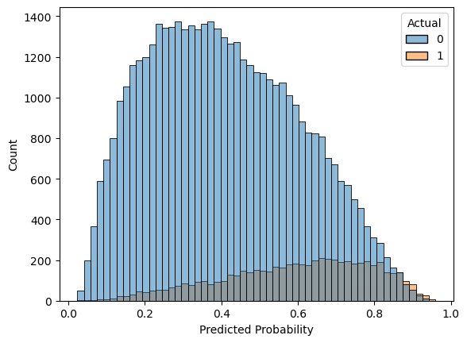
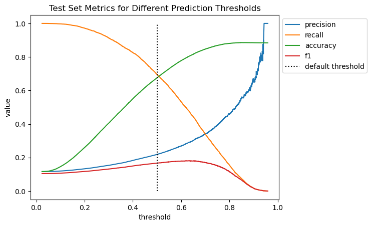
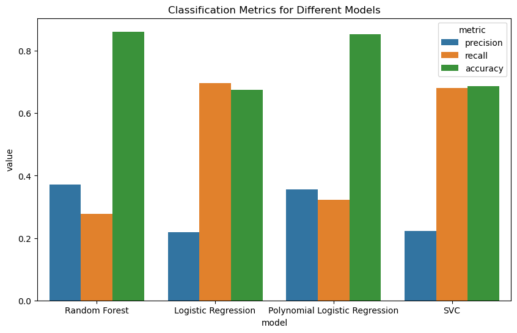
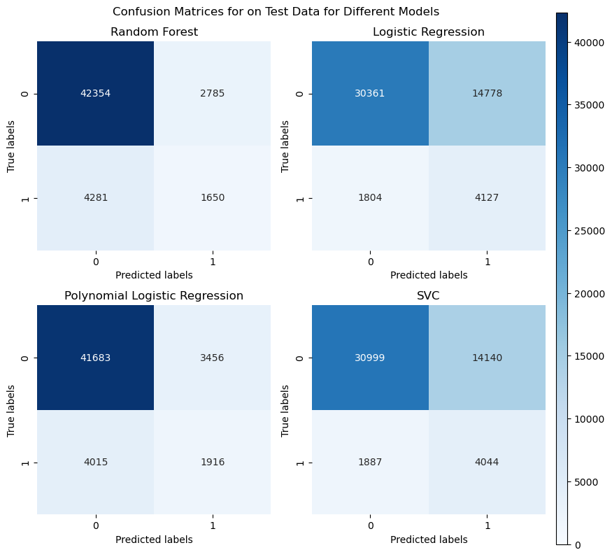

# Title

## Introduction to data
>TODO: Where we got it, what it's used for

This dataset has 255,347 cases and 17 predictor columns. When we one-hot encoded the categorical features we ended up with 24 predictors. None of the variables were highly correlated with each other and there were no outliers. We also standardized the numeric variables. The predictor names are as follows:

**Numeric**
- `Age`
- `Income`
- `LoanAmount`
- `CreditScore`
- `MonthsEmployed`
- `NumCreditLines`
- `LoanTerm`
- `InterestRate`
- `DTIRatio`

**Categorical**
- `Education` (4 levels)
- `EmploymentType` (4 levels)
- `MaritalStatus` (3 levels)
- `HasMortgage` (2 levels)
- `HasDependents` (2 levels)
- `LoanPurpose` (5 levels)
- `HasCoSigner` (2 levels)

One thing we need to look out for is the imbalanced class distribution in the target variable: Only 12% of the cases had a `Default` value of 1 which makes sense given that most of the time people do not default on their loans. Given the high number of cases, we were able to undersample the majority class using `RandomUnderSampler` from imblearn. 

## Model Selection and Tuning

We initially tested 3 different models for our classification: Logistic Regression, Support Vector Machine, and Random Forest, each validated and fine-tuned using cross validation. The stability of our cross-validation scores did not indicate any high variance or overfitting so dimensionality reduction was not a priority. 

Precision and recall are the primary metrics with which we will evaluate the models. In this context, precision refers to the accuracy of positive predictions, the proportion of cases predicted to default on loans who *actually* will, while recall is the proportion of cases that default that are *predicted* to default. It is unclear which metric is more important: Banks may experience more loss from lower recall, as falsely negative predictions means that someone was granted a loan and defaulted. From a humanitarian perspective, though, lower precision means that more people will have their loan applications rejected or face higher rates without a reliable reason. 

>TODO: Write a bit about what choices you made while fitting the model
### Random Forest

### SVM

Support Vector Machines are a particuarly useful classification mechanism because our data set has a lot of features. This makes SVM particularly useful because it is effective in high-dimensional spaces. Additionally, we can adjust the kernel type and slack parameter (C) to make the model be the best fit to our data. Using grid search as well as a series of trial-and-error attempts, we arrived at a slack parameter value of C = 0.5 and the kernel type set to rbf. We set the class_weights to 'balanced' but had experimented with adjusting the class weight ratio in the model since our main obstacle was that instances of the positive class (where default=1, or the people did default on their loans) was significantly outnumbered by instances of the negative class in our dataset. Instead of addressing this issue by adjusting the class weights, however, we ended up deciding to use sklearn's RandomUnderSampler - a tool that handles class imbalance by undersampling the majority class. We tried using both RandomUnderSampler and SMOTE (a similar technique that oversamples the minority class rather than undersampling the majority class) but decided to use RandomUnderSampler because it yielded better results in terms of predicting instances of the minority class.

Using all of the predictors,our SVM model yielded the follwoing metrics:
 - precision: 0.21
 - Recall: 0.70
 - Accuracy: 0.66

Because potential users of this model (banks and other lending companies) would care more about predicting true positives that true negatives (in other words, they care more about being able to accuratley predict people defaulting on their loans than predicting people to not default), we prioritized recall over precision in making this model

### Logistic Regression
One strength of logistic regression for this data is that its decision function returns a value between 0 and 1 that we can interpret as a probability that someone defaults. Additionally, the logistic regression function's coefficients can be interpreted just like linear regression's, with greater absolute values indicating a greater importance, assuming they are all scaled similarly. There is also the option of using regularization parameters `l1`, `l2`, and `elasticnet` in order to minimize coefficient values, resulting in a more stable model. We did not include these penalties in our model because cross validation showed stable performance, likely due to the large number of data points in our training set and the absence of outliers. 

Using all the predictors, our initial model had the following metrics:
- Precision: 0.22
- Recall: 0.70
- Accuracy: 0.68

We can visualize the distribution of predicted default probabilities to see how the model did:

This plot illustrates how cases where someone did not default (`Actual` value = 0) generally got low probabilites of default, resulting in true negative classifications yet a great proportion of them were past that 0.5 threshold, resulting in false positives. Similarly, the probabilities of default for postitive cases are a little skewed left, allowing a greater recall, that is, a higher proportion of positive default cases being identified.

The calculated precision and recall are based on a decision threshold of 0.5, which means that someone is predicted to default if the model returns a probability greater than 50%. Changing this threshold can change the model's expected precision and recall, depending on what one values more. 

### Conclusion on this?

## Comparing Models

Here is a summary chart of the metrics for our various models:

We can also see the distribution of false and true positives with these confusion matrices:

**Some of our observations:**
>TODO
-   observation 1
-   observation 2

## Ethical discussion
Our machine learning model to predict whether or not individuals will default on their loans, and all those like it, has the potential to make lending a much more equitable and transparent process. The usage of models like ours has the potential to enhance the efficiency and fairness of financial services. However, we would be remiss if we did not highlight its potential to be used unethically. It is imperative to ensure that such powerful tools are used responsibly and fairly. 

Improper usage of this model could lead to further discrimination and lack of accountability in the commercial lending process. Lending has historically been very unfair to people of certain racial groups and socioeconomic statuses and because these patterns are reflected in training data, banks and lending organizations who come to use models like these to make lending decisions need to be cautious of that. Regarding lack of accountability, without proper oversight, decisions made by the model could be inexplicable and irreversible, leaving individuals adversely affected by the model with no recourse. It is extremely important to maintain a high level of transparency about how the model operates. Financial institutions should be able to explain the factors leading to any particular decision, and individuals should have access to explanations of decisions that affect them. Unlike neural networks, the models we used here can output feature importance values, leading to a higher degree of transparency yet somewhat lack in classification ability. 
Predicting loan default is a very important decision because being able to receive or not receive a loan has tremendous implications for one’s financial wellbeing. Machine learning models have the ability to expedite the approval process and could be said to prevent human biases yet may end up reinforcing historical biases to the detriment of society at large. Because these decisions cannot afford to be taken lightly, we should strive to further research how we can integrate machine learning into the decision making process while still ensuring its fairness. 

## Conclusion
>TODO
